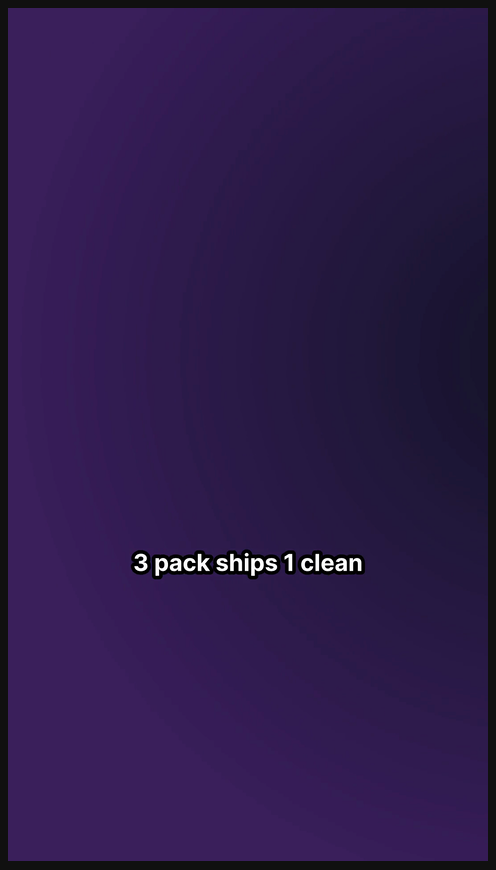
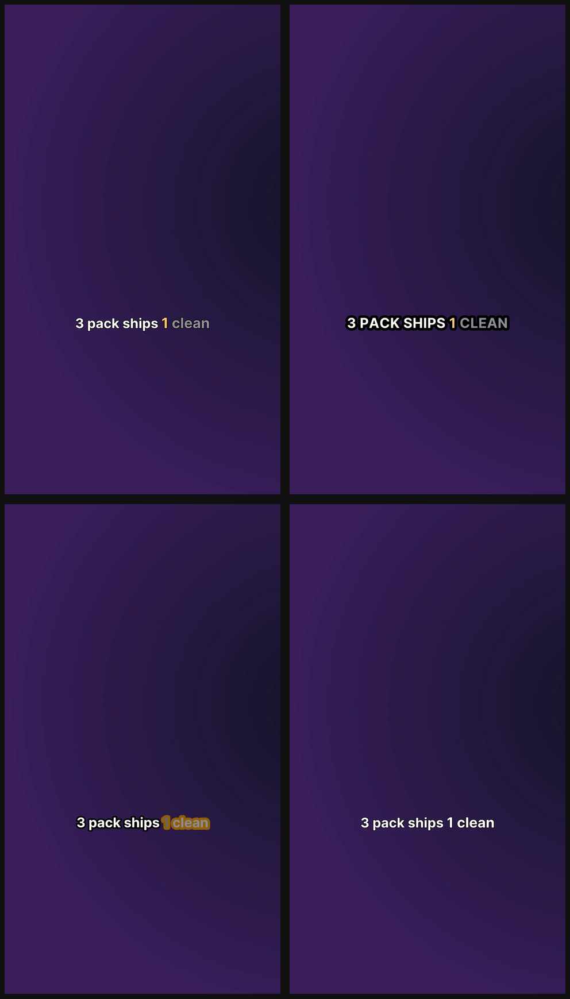

# captions-cli

[](https://github.com/jurczykpawel/captions-cli/actions/workflows/ci.yml)
[](LICENSE)
[](https://bun.sh)

**Burn word-level karaoke captions onto videos. Local Whisper + pluggable render engine. Zero SaaS.**

A one-command CLI that does what Submagic / CapCut Pro / Veed / Descript do — transcribe audio
with Whisper, then render an animated caption overlay onto your video. Difference: it runs on
your machine, with open-source tools, with no monthly fee, and your video never leaves the
laptop.

```bash
captions reel.mp4                                   # free style (clean-white)
captions reel.mp4 --preset hormozi --lang pl        # basic pack
captions reel.mp4 --preset single-word-pop          # premium pack
# → reel-captioned.mp4
```

## Quick start (no terminal experience needed)

You don't need to know how to code. You need [Docker Desktop](https://www.docker.com/products/docker-desktop/)
(free) and about 5 minutes.

1. **Install Docker Desktop** and open it — wait until its whale icon says *running*.
2. **Put your video in one folder.** Example: a folder `videos` with `reel.mp4` inside.
3. **Open a terminal in that folder:**
   - **macOS:** right-click the folder in Finder → *New Terminal at Folder*.
   - **Windows:** open the folder, click the address bar, type `cmd`, press Enter.
4. **Paste this one line** and press Enter. Change `reel.mp4` to your filename, and `en` to
   your spoken language (`pl`, `de`, `es`, …):
   ```bash
   docker run --rm -v "$PWD:/work" -v captions-cache:/data ghcr.io/jurczykpawel/captions-cli:slim /work/reel.mp4 --lang en
   ```
   On **Windows** use `"%cd%:/work"` instead of `"$PWD:/work"`.
5. **Done.** A new `reel-captioned.mp4` appears next to your video. The first run downloads a
   ~140 MB speech model (one time); after that it's instant and fully offline.

That's it — nothing is uploaded, no account, no subscription. Want other caption styles, a
one-line installer, or to run without Docker? See [Install](#install) below.

## Make it a real `captions` command

Don't want to paste the long `docker run …` line every time? Install a tiny wrapper once, then
just run `captions yourvideo.mp4 --lang pl` from any folder. It finds your video, mounts its
folder into the container, and writes the captioned copy right next to it.

**macOS / Linux:**

```bash
sudo curl -fsSL https://raw.githubusercontent.com/jurczykpawel/captions-cli/main/scripts/captions \
  -o /usr/local/bin/captions && sudo chmod +x /usr/local/bin/captions
```

**Windows (PowerShell):** download [`captions.cmd`](scripts/captions.cmd) **and**
[`captions.ps1`](scripts/captions.ps1) into one folder that's on your `PATH`.

Then, from anywhere:

```bash
captions reel.mp4 --lang pl
captions ~/Videos/talk.mp4 --lang en
captions --list-presets
# HF engine / other styles: point the wrapper at a different image
CAPTIONS_IMAGE=ghcr.io/jurczykpawel/captions-cli:full captions reel.mp4 --engine hf
```

Still uses the Docker image under the hood (so Docker must be running) — but nothing else to
install. Want a **native** binary with no Docker at all? That's also a real `captions` command —
see [Install](#install) (Options B, C, E).

## Style packs (ASS engine)

The ASS engine ships **25 caption presets organized into three packs**. Free pack is
included in the public Docker image. Basic and Premium are paid one-time downloads
shipped as separate Docker tags.

| Pack | Count | Price | Includes |
|---|---|---|---|
| **Free** | 1 | included | `clean-white` — bold white + heavy black outline. Always readable. |
| **Basic** | 4 | **47 PLN** *(one-time)* | Free + `outline-pop`, `hormozi`, `pill`, `pop-word` |
| **Premium** | 20 | **97 PLN** *(one-time)* | Basic + 20 premium styles (color variants, single-word, news-ticker, mrbeast, neon-*, karaoke-*, cinema-classic, …) |

Preview grids:

| Free | Basic | Premium |
|---|---|---|
|  |  |  |

Run `captions --list-presets` to see the full grouped catalog. See [`PACKS.md`](PACKS.md)
for the design rationale behind the split (which look serves which use case).

## Two render engines

The CLI dispatches to one of two engines via `--engine`:

| Engine | What it uses | Image | Render speed (41 s clip) | Style pack support |
|---|---|---|---|---|
| **`ass`** *(default)* | `ffmpeg` + `libass` (no browser) | **~870 MB** | **~3 s** | Free / Basic / Premium pack split (this is where the catalog lives) |
| **`hf`** | Hyperframes (HTML+CSS+GSAP via headless Chromium) | ~1.6 GB | ~40 s | 9 universal presets — full CSS power for exact fidelity (filter blur, 3-D transforms) |

Both engines produce valid karaoke captions with the same word-level timing. Pick `hf`
when you need CSS-perfect effects that libass simplifies (multi-layer glow, easing curves).

```bash
captions reel.mp4                              # ASS, free pack default
captions reel.mp4 --engine hf                  # opt in for full CSS power
captions reel.mp4 --engine hf --preset glow    # HF-only CSS glow
```

## Why this exists

Submagic is 19-69 USD/month. CapCut Pro is 89 PLN/month. Veed.io is 25 EUR/month. Descript
Creator is 24 USD/month. They all run [Whisper](https://github.com/openai/whisper) (open-source
since 2022) plus [ffmpeg](https://ffmpeg.org) (open-source since 2000). Your laptop has both.

A 60-second reel transcribes in ~3 s on an M-series Mac and burns captions in another ~3 s with
the ASS engine. End-to-end: under 10 seconds, free, offline.

This CLI is the open-source companion to a TechSkills Academy guide on captioning video locally.
Free, MIT-licensed, no watermark.

## Install

Pick one. Listed easiest → most flexible.

### Option A — Docker (zero local deps)

Two image variants. **Pre-built images are published to GHCR with each
[release](https://github.com/jurczykpawel/captions-cli/releases)** (tags `:slim` / `:full`,
plus the version, e.g. `:1.0.0-slim`):

```bash
# SLIM: ass engine only. ~870 MB. Recommended for most use cases.
docker pull ghcr.io/jurczykpawel/captions-cli:slim
docker run --rm \
  -v "$PWD:/work" \
  -v "captions-cache:/data" \
  ghcr.io/jurczykpawel/captions-cli:slim \
  /work/reel.mp4 --lang pl

# FULL: ass + hf. ~1.6 GB. Use when you need --engine hf. (linux/amd64 only;
# on Apple Silicon it runs under emulation — for arm64-native use :slim.)
docker pull ghcr.io/jurczykpawel/captions-cli:full
docker run --rm -v "$PWD:/work" -v "captions-cache:/data" \
  ghcr.io/jurczykpawel/captions-cli:full \
  /work/reel.mp4 --engine hf --preset glow
```

The named volume `captions-cache` persists the Whisper model (~140 MB) — the first run
downloads it, subsequent runs are offline.

Or build the image yourself (always works, no release needed):

```bash
git clone https://github.com/jurczykpawel/captions-cli
cd captions-cli
docker build -f Dockerfile.slim -t captions-cli:slim .   # ass engine, free pack
# docker build -f Dockerfile.full -t captions-cli:full .  # + hf engine
docker run --rm -v "$PWD:/work" -v "captions-cache:/data" captions-cli:slim /work/reel.mp4 --lang pl
```

> The public image ships the **free** `clean-white` preset. Paid packs are built into private
> images — see [Building images with paid packs](#building-images-with-paid-packs).

### Option B — one-liner installer (Mac + Linux)

```bash
# ASS engine only (default)
curl -fsSL https://raw.githubusercontent.com/jurczykpawel/captions-cli/main/install.sh | bash

# also install the HF engine (hyperframes)
curl -fsSL https://raw.githubusercontent.com/jurczykpawel/captions-cli/main/install.sh | bash -s -- --with-hf
```

Installs `ffmpeg`, `whisper-cpp` and `bun`, then **builds** the `captions` binary from source
and drops it into `/usr/local/bin`. Idempotent — safe to re-run. The installer checks whether
your `ffmpeg` has libass and warns if not (the ASS engine needs it — see Troubleshooting).

### Option C — pre-built binary (no Node, no Bun)

Grab the binary for your OS from [Releases](https://github.com/jurczykpawel/captions-cli/releases)
(available from v1.0.0 on), then install the system tools manually:

```bash
brew install ffmpeg whisper-cpp           # Mac. Note: brew's stock ffmpeg
                                          # may lack libass — see Troubleshooting.
sudo apt install ffmpeg                   # Linux (whisper.cpp from source)
chmod +x /usr/local/bin/captions
```

For HF engine: also `npm install -g hyperframes` (needs Node 22+ once).

The binary is ~60 MB (Bun runtime is baked in). No Node/Bun required to **run** it.

### Option D — VPS via Stackpilot (`./local/deploy.sh captions-cli`)

If you already use [Stackpilot](https://github.com/jurczykpawel/stackpilot) to manage a VPS,
captions-cli ships as a built-in app:

```bash
./local/deploy.sh captions-cli                # installs slim image (~870 MB)
VARIANT=full ./local/deploy.sh captions-cli   # if you need --engine hf
```

The installer pulls the Docker image and drops a `/usr/local/bin/captions` wrapper that mounts
`$PWD` as `/work`. Then you SSH in and use the CLI like a native binary:

```bash
ssh user@vps
cd ~/captions
captions reel.mp4 --preset hormozi --lang pl
```

Same UX as local Docker (Option A), zero hosting setup. Works on a 1 GB Mikrus with `slim`.

### Option E — from source (developers)

```bash
brew install ffmpeg whisper-cpp bun       # Mac
git clone https://github.com/jurczykpawel/captions-cli
cd captions-cli
bun install                               # workspaces install
bun run captions video.mp4
```

Build your own standalone binary:

```bash
bun run build                             # → ./dist/captions
```

## Project layout

This is a **Bun workspaces monorepo**. Each engine is its own package; the CLI dispatches
between them by `--engine` flag.

```
captions-cli/
├── package.json                 # workspaces: ["packages/*"]
├── packages/
│   ├── core/                    # shared: types, ffprobe, transcribe, cue grouping
│   ├── engine-hf/               # Hyperframes (CSS+GSAP) + presets/
│   │   └── src/presets/         # only `text.ts` ships in git; basic + premium
│   │                            # are gitignored, repopulated at build time
│   ├── engine-ass/              # ffmpeg+libass + presets/
│   │   └── src/presets/         # only `clean-white.ts` ships in git; basic +
│   │                            # premium are gitignored, repopulated at build time
│   └── cli/                     # bin entry, dispatcher
├── packs/                       # GITIGNORED — paid pack source, per engine
│   ├── ass/{basic,premium}/     # ffmpeg+libass preset packs
│   └── hf/{basic,premium}/      # Hyperframes preset packs
├── scripts/
│   ├── install-pack.sh          # `./install-pack.sh <free|basic|premium>`
│   ├── generate-presets-index.mjs   # auto-generates presets/index.ts
│   ├── demo-packs.sh            # renders every preset → ~/Downloads/caption-packs-demo/
│   └── demo-final.sh            # legacy 9-preset demo
├── assets/previews/             # 25 preview PNGs + 3 grids (committed)
├── PACKS.md                     # design rationale for the 3-tier split
├── Dockerfile.slim              # ASS-only (~870 MB)
├── Dockerfile.full              # ASS + HF (~1.6 GB)
├── install.sh                   # Mac + Linux installer
└── README.md
```

### Building images with paid packs

The public repo ships only the free `clean-white` preset. Owners of the basic/premium packs
drop the `.ts` files into `packs/` and bake them into a private image:

```bash
./scripts/install-pack.sh premium       # copies packs/* into presets/, regenerates index.ts
docker build -f Dockerfile.slim -t captions-cli:slim-premium .
./scripts/install-pack.sh free          # restore git-clean state (free pack only)
```

## Preset designer (offline)

`studio/index.html` is a self-contained HTML+JS app. Open it in any modern
browser via `file://` — no server, no backend. Tweak typography / outline /
animation / position with live CSS preview, then click **Download .ts** to
get a ready-to-drop preset file. Move it into `packs/<engine>/premium/` (e.g.
`packs/ass/premium/`), run `./scripts/install-pack.sh premium`, and the CLI sees your custom slug.

```bash
open studio/index.html      # macOS
xdg-open studio/index.html  # Linux
```

The preview is a CSS approximation — the real ffmpeg+libass render may
differ slightly for blur and outline rendering, but typography, colour,
and active-state effects are pixel-accurate.

## Usage

```bash
captions <video.mp4> [options]
captions --list-presets [--engine hf|ass]
captions --list-engines
captions --help
```

Common recipes:

```bash
# Default look (clean-white, free pack, English, ASS engine)
captions reel.mp4

# Polish, Hormozi-style, custom highlight colour (basic pack)
captions reel.mp4 --preset hormozi --lang pl --color "#F59E0B"

# Submagic-style: one word at a time (premium pack)
captions reel.mp4 --preset single-word

# 3-state karaoke (past white / active amber / upcoming grey)
captions reel.mp4 --preset outline-pop --upcoming "#8E8E9C"

# Switch to HF engine for CSS-perfect glow
captions reel.mp4 --engine hf --preset glow

# Custom output path
captions reel.mp4 --output viral.mp4

# Use OpenAI Whisper API instead of local whisper-cpp
export OPENAI_API_KEY=sk-…
captions reel.mp4 --whisper openai
```

## Preset catalog (ASS engine)

Run `captions --list-presets` for the live grouped list. Each preset has a 6-second
preview rendered at `assets/previews/<tier>/<slug>.png` — see [`PACKS.md`](PACKS.md) for
the rationale behind the split.

### Free pack (included)

| Slug | Look |
|---|---|
| `clean-white` | **Default.** Bold white + 8 px black outline. Multi-word. No animation, no color highlight. Reads on any background. |

### Basic pack — 47 PLN

| Slug | Look |
|---|---|
| `outline-pop` | UPPERCASE + 10 px outline + active word in accent color. Submagic-style. |
| `hormozi` | White Bold + active word in accent + scale 1.15. Business benchmark. |
| `pill` | Solid colored pill bg behind active word. |
| `pop-word` | White Bold + subtle scale bounce on active. Reads on any background. |

### Premium pack — 97 PLN

20 styles across all categories (single-word focus, color variants, decorative
backgrounds, motion, cinematic). Includes basic + free.

- **Single-word focus** — `single-word`, `single-word-pop`, `single-word-fade`
- **Color variants** — `hormozi-red`, `hormozi-green`, `hormozi-cyan`, `neon-yellow`, `neon-cyan`, `neon-pink`
- **Backgrounds** — `box-highlight`, `pill-shadow`, `news-ticker`
- **Motion** — `bouncing`, `underline-sweep`
- **High-energy** — `mrbeast`
- **Karaoke** — `karaoke-fill`, `karaoke-shadow`
- **Cinematic** — `subtitle-classic`, `whisper-mini`, `mono-block`

### HF engine presets

The HF engine ships **9 universal presets** independent of the pack split (`outline-pop`,
`hormozi`, `pop-word`, `pill`, `glow`, `underline-sweep`, `box-highlight`, `single-word`,
`text`). Pick HF when you need CSS-only effects like multi-layer glow.

## All options

```
--engine <name>          ass (default) | hf
--preset <slug>          ASS engine: 25 presets in 3 packs (see --list-presets). Default: clean-white
                         HF engine: 9 universal presets. Default: outline-pop
--output <path>          Default: <input>-captioned.mp4
--lang <code>            Whisper language (en, pl, de, fr, …). Default: en
--color <hex>            Active word colour. Default: #F59E0B (amber)
--upcoming <hex>         Not-yet-spoken word colour (3-state karaoke)
--position <0-100>       Vertical % from top (65 = cross-platform safe zone). Default: 65
--font-size <px>         Default: 64
--font-color <hex>       Past-word colour. Default: #FFFFFF
--whisper <provider>     whisper-cpp (default, free, local) | openai
--whisper-model <id>     ggml-tiny|base|small|medium|large-v3-turbo.bin
                         Default: ggml-base.bin (~140 MB, balanced)
```

## How it works

```
input.mp4
  └─ ffprobe → duration + dimensions
       └─ ffmpeg → 16 kHz mono WAV (audio extract)
            └─ whisper-cpp / OpenAI → word-level timestamps
                 └─ groupWordsIntoCues → cues (≤5 words / ≤3 s each)
                      ├─ engine=ass → libass → ffmpeg subtitles filter → MP4
                      └─ engine=hf  → hyperframes → headless Chromium → MP4
```

Three colour states per word are tracked by:
- **ASS**: inline tag transitions `\t(t1,t1+1,\c<color>)` flipping colour at word boundaries
- **HF**: GSAP timeline applies `.word--past` / `.word--active` / `.word--upcoming` classes per
  frame, CSS rules from the preset block style them

Both engines respect the same 3 colours: past = `--font-color`, active = `--color`,
upcoming = `--upcoming` (defaults to past when omitted).

## Whisper providers

**`whisper-cpp` (default)** — runs locally, free, offline. Requires `whisper-cli` on PATH
(`brew install whisper-cpp`). Models live in `~/.cache/whisper.cpp/`.

**`openai`** — OpenAI's hosted Whisper API. Requires `OPENAI_API_KEY`. Costs ~$0.006 per audio
minute. Faster than whisper-cpp on slower CPUs and on languages where small whisper-cpp models
hallucinate.

## Whisper model cheat-sheet

| Model | Size | Speed | Quality | When to use |
|---|---|---|---|---|
| `ggml-tiny.bin` | 39 MB | fastest | low | Quick drafts, English-only |
| `ggml-base.bin` | 140 MB | fast | OK | **Default** — good balance |
| `ggml-small.bin` | 466 MB | medium | good | Multilingual, mid-quality |
| `ggml-medium.bin` | 1.4 GB | slow | great | Long-form, proper nouns |
| `ggml-large-v3-turbo.bin` | 1.5 GB | medium | best | Production captions |

Override with `--whisper-model ggml-small.bin` etc.

## Three-state karaoke

Each word goes through three states as the timeline plays:

- **Past** (already spoken) → `--font-color` (default white)
- **Active** (being spoken now) → `--color` (default amber `#F59E0B`)
- **Upcoming** (not yet spoken) → `--upcoming` (default = past, so 2-state)

Pass `--upcoming "#8E8E9C"` for the full Submagic-style 3-state read where unspoken words are
dimmed grey and "fill in" as they're hit.

## Troubleshooting

| Error | Fix |
|---|---|
| `whisper-cli: command not found` | `brew install whisper-cpp` |
| `ffmpeg: command not found` | `brew install ffmpeg` |
| `ffmpeg was built without libass` (or `No such filter: 'subtitles'`) | Your ffmpeg lacks libass. Easiest: use the Docker image (ships it). Or `brew reinstall ffmpeg` (macOS) / rebuild with `--enable-libass`. Verify: `ffmpeg -filters \| grep subtitles`. Or switch engines: `--engine hf`. |
| `hyperframes: command not found` *(only with `--engine hf`)* | `npm i -g hyperframes` (or `bun add -g hyperframes`). Slim image doesn't ship HF — use `:full`. |
| `Unknown engine "hf"` from slim image | Slim is ASS-only. Use `:full` Docker image or install HF deps locally. |
| Wrong language detected | Pass `--lang pl` (or whatever) explicitly |
| Captions misaligned | Try `--whisper-model ggml-large-v3-turbo.bin` |
| `OpenAI Whisper failed: 401` | `export OPENAI_API_KEY=sk-…` |
| Render takes minutes on first HF run | Hyperframes downloads Chromium (~150 MB). Subsequent fast. |
| Polish diacritics garbled | Default `ggml-base.bin` handles Polish; if still wrong, try `ggml-large-v3-turbo.bin` |

## License

MIT. Built on top of:

- [ffmpeg](https://ffmpeg.org) + [libass](https://github.com/libass/libass) — LGPL/GPL/ISC
- [Hyperframes](https://hyperframes.heygen.com) — Apache-2.0 (only `--engine hf`)
- [whisper.cpp](https://github.com/ggerganov/whisper.cpp) — MIT
- [Bun](https://bun.com) — MIT (only at build time when compiling the standalone binary)

## See also

- **TechSkills Academy guide** (Polish) — on captioning video locally; this CLI is its
  open-source companion.
- **ReelStack** — the larger reel-generation pipeline (TTS + LLM director) these caption
  presets were originally extracted from; captions-cli is the minimal standalone carve-out.
